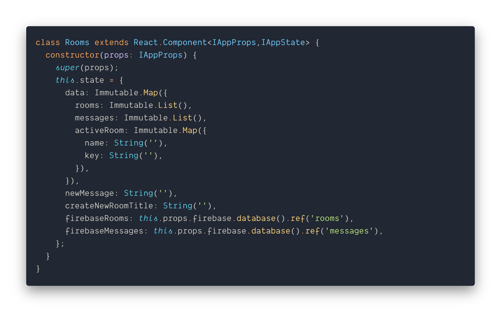

# Chat App
[](https://www.codacy.com/app/csantiago132/chat-app?utm_source=github.com&amp;utm_medium=referral&amp;utm_content=csantiago132/chat-app&amp;utm_campaign=Badge_Grade)
[](https://github.com/prettier/prettier)

<p align="center"></p>

A CRUD (Create, Read, Update, Delete) chat application built with Typescript, React, Firebase and Immutable.JS.

## Prerequisites
> - Yarn >= 1.5.x
> - Node >=8.x

## Getting Started

These instructions will get you a copy of the project up and running on your local machine for development and testing purposes. See deployment for notes on how to deploy the project on a live system.

1. Clone this repo using `git clone https://github.com/csantiago132/chat-app.git`
2. Move to the appropriate directory: `cd chat-app`
3. Register a database with [Firebase](https://firebase.google.com/docs/database/)
4. Get a configuration and save it on the `app/secretApiInfo` directory
```js
import firebase from 'firebase';

let config = {
  apiKey: 'YOUR_API_KEY',
  authDomain: 'YOUR_AUTH_DOMAIN',
  databaseURL: 'YOUR_FIREBASE_URL',
  projectId: 'YOUR_PROJECT_ID',
  storageBucket: 'YOUR_STORAGE_BUCKET',
  messagingSenderId: 'YOUR_MESSAGING_ID',
};

firebase.initializeApp(config);

export default firebase;
```
(This is used on the main state of the `App/index` container)

5. Run `yarn install` or `npm install` in order to install dependencies
6. Run `yarn start` or `npm start` 
7. The project will be available on `http://localhost:4000`


## Features
- [x] Typescript
- [x] Google authentication
- [x] Public rooms
- [x] Realtime sending and receiving of messages
- [x] Able to delete messages (as long as the user was the one that sent it)
- [x] Able to delete chat rooms (as long as the user was the one that created it it)
- [ ] Private rooms
- [ ] Update previously created messages
- [ ] Rich media attachments (drag and drop)
- [ ] Typing and presence indicators
- [ ] Read message cursors


### Sidenote:

> UI and UX improvements are in the works, the main priority on my end has been creating the logic, incorporate Typescript, setting up state with Immutable.JS and making sure that the CRUD concepts are covered before moving on.


## TODO List 
In the near future, I want to add: 
- [ ] Redux
- [ ] Reselect
- [ ] React Native or Electron version
- [ ] Eject from create-react-app v2.1 and customize webpack configuration


## Built With

* [Typescript](https://github.com/Microsoft/TypeScript) - A superset of JavaScript
* [ReactJS](https://reactjs.org/) - A JavaScript library for building user interfaces
* [Firebase](https://firebase.google.com/) - Firebase is a Backend as a Service (BaaS) provided by Google.
* [Immutable](http://facebook.github.io/immutable-js/) - Immutable collections for JavaScript


## Versioning

I use [SemVer](http://semver.org/) for versioning. For the versions available, see the [tags on this repository](https://github.com/csantiago132/chat-app/releases). 

## Authors

* **Carlos Santiago** - *Initial work* - [csantiago132](https://github.com/csantiago132)


## License

This project is licensed under the MIT License - see the [LICENSE.md](LICENSE.md) file for details


## Acknowledgments

* **Kenneth Liu** - *for motivation* - [github](https://github.com/ksliu25)
* **Andy Babbitt** - *for motivation* - [linkedin](https://www.linkedin.com/in/andy-babbitt-ba142319/)
* **Cory Trimm** - *for mentoring* - [github](https://github.com/ctrimm)

